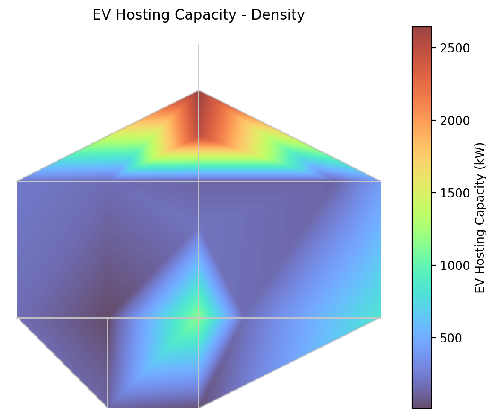

# EV Hosting Capacity

DISCO computes the maximum amount of EV charging load a distribution feeder can absorb
before violating voltage or thermal limits, using OpenDSS power flow simulations.

## Installation

```bash
git clone <repo>
cd disco
pip install -e .
```

## Quick Start

The Python API is built around three classes: `Feeder`, `EVHostingCapacity`, and
`EVHostingCapacityResults`.

```python
import disco
from pathlib import Path

master = Path("disco/ev/example_feeders/opendss/ieee13/Master.dss")
output_dir = Path("output/opendss_13Bus")

feeder = disco.Feeder.from_opendss(master)
results = disco.EVHostingCapacity(feeder=feeder).run(output_dir=output_dir)

print(results.summary())
```

`Feeder` can also be built from a [GDM](https://github.com/NREL/grid-data-models)
distribution-system JSON via `disco.Feeder.from_gdm(gdm_path)` — this writes a
sibling `<stem>_opendss_export/Master.dss` using `ditto` and points the `Feeder`
at it. The rest of the pipeline is identical.

Example output:

```
EV Hosting Capacity Summary — 13Bus_standard_format Feeder
==========================================================
Runtime:             12.34 seconds
Nodes analyzed:      15
Voltage-limited:     0 nodes
Thermal-limited:     15 nodes
Median capacity:     40 kW
Mean capacity:       393 kW
Min capacity:        10 kW
Max capacity:        2660 kW
```

> **Reading the summary** — `Voltage-limited`/`Thermal-limited` is the count of nodes
> whose binding constraint was each type. A `Min capacity: 0 kW` would mean some nodes
> already violate at their baseline load; a `Max capacity` near 999990 kW would be the
> bisector's `UPPER_CAP` sentinel (no violation reachable, capacity effectively unbounded).

### Tuning the analysis

Pass an `EVHostingCapacityConfig` to override the default voltage/thermal limits and
search parameters. It can go to either the constructor or `.run()`:

```python
from disco.ev.config import EVHostingCapacityConfig

config = EVHostingCapacityConfig(
    voltage_lower_limit_pu=0.96,
    voltage_upper_limit_pu=1.06,
    thermal_loading_limit_percent=120.0,
)

results = disco.EVHostingCapacity(feeder=feeder, config=config).run(output_dir=output_dir)
```

Defaults: `voltage_lower_limit_pu=0.95`, `voltage_upper_limit_pu=1.05`,
`thermal_loading_limit_percent=100.0`, `voltage_step_kw`/`thermal_step_kw=10.0`,
`voltage_search_tolerance_kw`/`thermal_search_tolerance_kw=10.0`,
`existing_overload_headroom_percent=5.0`, `screen_all_buses=True`.

### Visualizing the result

```python
results.plots.density()
```



`results.plots` also exposes `.binding()`, `.contour()`, `.branch()`, `.nodal()`, and
`.all()` (a 2×2 panel of density, binding, branch, and nodal).

### Loading a past run without re-simulating

```python
from disco.ev.results import EVHostingCapacityResults

results = EVHostingCapacityResults.from_db(output_dir)
print(results.summary())
```

This reads everything back from `output_dir/disco_ev_hc.db`. Useful when iterating on
analysis without paying the simulation cost again.

## Output

A successful run produces a single self-contained file:

```
output_dir/
└── disco_ev_hc.db        # SQLite database — all tables below
```

Open it with any SQLite viewer (DB Browser for SQLite, VS Code's SQLite extension,
the `sqlite3` CLI) or read tables back via `EVHostingCapacityResults` methods.

Stored tables: `voltage_screen`, `thermal_screen`, `hosting_capacity`, `chargers`,
`bus_distances`, `bus_coordinates`, `line_segments`, `simulation_metadata`.

The `hosting_capacity` table is the recommended per-load answer — it combines the voltage
and thermal screens (taking the binding minimum) and includes a `Binding_constraint`
column. Read it back via `results.hosting_capacity()`.

## The Three Classes

### `disco.Feeder`

Represents a feeder loaded from an OpenDSS master file.

| Method / Attribute | Returns | Notes |
|---|---|---|
| `Feeder.from_opendss(master_path)` | `Feeder` | Classmethod — wrap an existing OpenDSS `Master.dss` |
| `Feeder.from_gdm(gdm_path)` | `Feeder` | Classmethod — convert a GDM JSON to OpenDSS via `ditto`, then wrap it |
| `feeder.master_file` | `Path` | Path to `Master.dss` (the one actually used by the run) |
| `feeder.name` | `str` | Feeder name (parent dir name, or GDM stem when built `from_gdm`) |
| `feeder.validate()` | `None` | Raises if the master file can't be compiled |

### `disco.EVHostingCapacity`

The simulation runner.

| Method / Attribute | Returns | Notes |
|---|---|---|
| `EVHostingCapacity(feeder, num_cpus=None, config=None)` | instance | `num_cpus=None` → `os.cpu_count()`; `config=None` → `EVHostingCapacityConfig()` defaults |
| `.run(output_dir, config=None)` | `EVHostingCapacityResults` | Runs voltage + thermal bisections in parallel; writes to SQLite |

### `disco.ev.results.EVHostingCapacityResults`

Results container. Methods either compute on in-memory DataFrames or read from
the run's SQLite DB (lazy, queried each call).

| Method | Returns | Source |
|---|---|---|
| `summary()` | `str` | computed |
| `hosting_capacity()` | `DataFrame` | SQLite table `hosting_capacity`; combines voltage + thermal, includes `Binding_constraint` |
| `voltage_screen()` | `DataFrame` | SQLite table `voltage_screen` |
| `thermal_screen()` | `DataFrame` | SQLite table `thermal_screen` |
| `chargers()` | `DataFrame` | SQLite table `chargers` |
| `bus_distances()` | `DataFrame` | SQLite table `bus_distances` |
| `simulation_metadata()` | `dict[str, str]` | SQLite table `simulation_metadata` |
| `bus_coordinates()` | `DataFrame` | SQLite table `bus_coordinates` (used by plots) |
| `line_segments()` | `DataFrame` | SQLite table `line_segments` (used by plots) |
| `plots` *(property)* | `EVHostingCapacityPlots` | `.density()`, `.contour()`, `.branch()`, `.nodal()`, `.all()` |
| `db_path` *(property)* | `Path` | Path to `disco_ev_hc.db` |
| `EVHostingCapacityResults.from_db(output_dir)` *(classmethod)* | instance | Reload past run from disk |

`summary()` and `hosting_capacity()` are the authoritative answer. The other table
readers expose the raw voltage/thermal screens and inputs for ad-hoc analysis.

## Algorithm

This tool computes **nodal hosting capacity** — for each load node individually, it finds
the maximum EV charging load that node can absorb before any voltage or thermal limit is
violated anywhere in the feeder. Each node is tested in isolation, so the results
represent the headroom at each connection point independently, not the capacity when all
nodes charge simultaneously (system-level HC).

The tool runs two independent binary searches (bisection) per load node:

**Voltage search:** Starting at 2× the current load kW, the tool doubles the load until a
voltage violation occurs (any bus outside `[lower_limit, upper_limit]`), then bisects
between the last passing value and the first violating value until convergence.

**Thermal search:** Same approach, but the violation condition is any line or transformer
exceeding `thermal_loading_limit` (default 100%).

Both searches run in parallel across all load nodes using Python `ProcessPoolExecutor`.

### Edge cases handled by the bisector

- **OpenDSS solver non-convergence** is treated as a violation (the bisector backs off
  rather than diverging at extreme kW).
- **No violation reachable** — the bisector caps `cur_value` at
  `ViolationBisector.UPPER_CAP = 1_000_000.0` kW. Nodes that hit the cap appear in the
  output with `Maximum_kW ≈ 1_000_000` and should be interpreted as *"no realistic
  voltage/thermal limit found within this feeder"* — not as 1 GW of literal capacity.
- **Already-overloaded loads** report a hosting capacity of 0 kW (clamped) rather than a
  negative number.

> **Interpretation note:** Because each node is tested independently, the results are
> optimistic — they represent the maximum each node could absorb on its own. In reality,
> if multiple nodes charge simultaneously, the combined stress on the network would reduce
> the actual capacity available at each node.

## Charger Level Assignment

Given the additional hosting capacity (kW) at each node, chargers are assigned greedily:

1. As many **Level 3 (XFC)** chargers as fit at 350 kW each
2. Remaining kW filled with **Level 2** at 7.2 kW each
3. Any remainder filled with **Level 1** at 3.3 kW each

Example: 500 kW available → 1× L3 (350 kW) + 20× L2 (144 kW) + 1× L1 (3.3 kW)

## Tips

- **Baseline power flow must be within limits.** The bisector starts from the existing
  baseline load on each node and searches *upward* for the first violation. If the
  feeder is already outside `[lower_voltage_limit, upper_voltage_limit]` or above
  `thermal_loading_limit` at its baseline (before any EV load is added), affected nodes
  report a hosting capacity of 0 kW — the search has nowhere to go. The run logs a
  `WARNING` at startup in this case (`Initial condition has voltage violation before EV
  load is added` / `Thermal violation exists initially`); check for it before
  interpreting a result with many zero-capacity nodes. Fix the baseline (regulator
  taps, capacitor settings, conductor sizing) and re-run.
- **`num_cpus`** defaults to `os.cpu_count()` — typically all logical cores. On a shared
  workstation, leave 1–2 cores free (`num_cpus=os.cpu_count() - 2`). Each worker
  re-compiles OpenDSS at the start of every load it processes, so for feeders with very
  few loads (<30) the spawn overhead can dominate — try `num_cpus=4` first.
